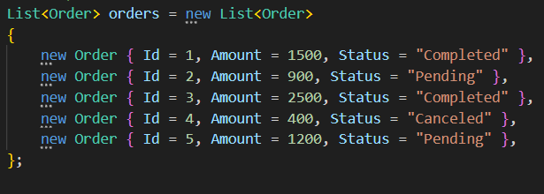
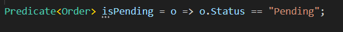
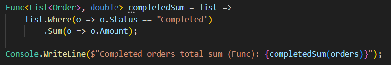
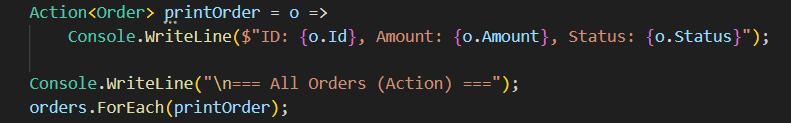
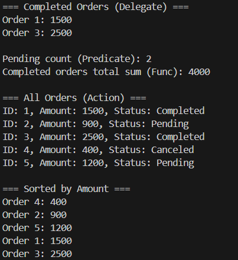

# Лабораторна робота №6

## Тема: Делегати, лямбда-вирази та LINQ

## Завдання

- Створити клас Order (id, сума, статус).
- Лямбда-виразами підрахувати: загальну суму виконаних замовлень (Completed); кількість замовлень зі статусом Pending; виконати сортування за сумою.
- Використати: власний делегат; анонімні методи; лямбда-вирази; `Func<>`, `Action<>`, `Predicate<>`; `LINQ (Where, OrderBy, Aggregate, Select)`.
- Продемонструвати роботу у `Main()`.

## Виконання та реалізація

Програма складається з класу `Order`, власних делегатів, анонімних методів та LINQ-операторів.

- Клас `Order`. Клас містить інформацію про замовлення: ID, суму та статус.

- Власний делегат `OrderFilter` Створено власний делегат для фільтрації замовлень:

- Колекція замовлень у `Main()`. У Main створено список об’єктів Order з різними статусами та сумами:

- Анонімний метод.Використано анонімний делегат для вибору виконаних замовлень (Completed).

- Використання `Predicate<T>`. `Predicate<Order>` застосовано для визначення кількості замовлень зі статусом "Pending":

- Використання `Func<T>` За допомогою `Func<List<Order>, double>` обчислюється загальна сума виконаних замовлень:

-Вбудований делегат `Action<T>`. `Action<Order>` застосовано для виводу всіх замовлень у консоль:

- LINQ: сортування, пошук, агрегація. Використано такі оператори: Where — фільтрація за статусом, OrderBy — сортування за сумою, Aggregate — загальна сума всіх замовлень

## Результати

