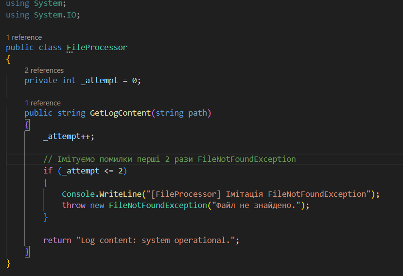
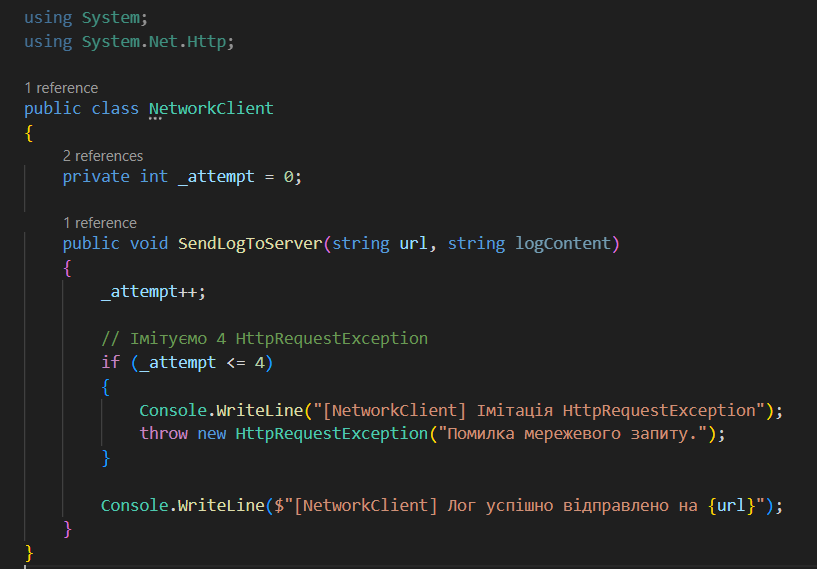
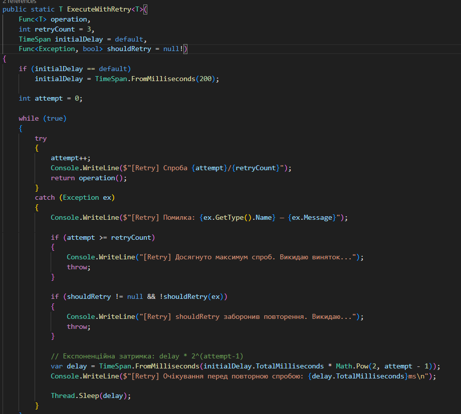
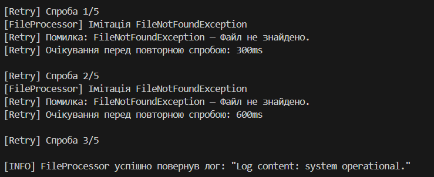
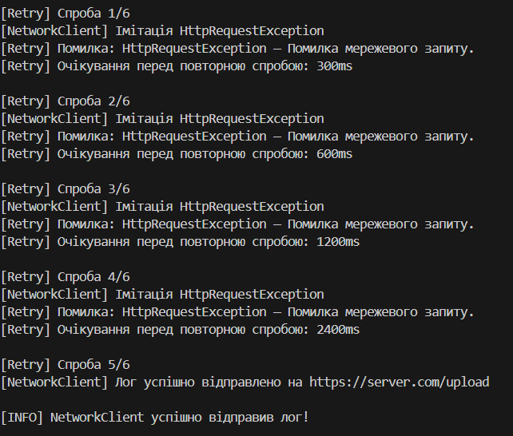

# Лабораторна робота №7

## Тема: Обробка винятків, Retry-патерн, мережеві та файлові помилки

## Завдання:

- Реалізувати класи FileProcessor та NetworkClient, які імітують роботу з файлами та мережею.

- Створити універсальний клас RetryHelper з експоненційною затримкою.

- Реалізувати механізм повторних спроб при помилках: FileNotFoundException, HttpRequestException.

- Продемонструвати роботу в Main().

- Створити сценарій Відправка логів: FileProcessor — 2 рази помилка, потім успіх. NetworkClient — 4 рази помилка, потім успіх. shouldRetry — повторювати тільки для потрібних винятків.

- Вивести всі результати в консоль.

## Виконання та реалізація:

Програма складається з наступних компонентів: класів `FileProcessor`, `NetworkClient`, універсального механізму повторних спроб — `RetryHelper`, демонстрації роботи в `Main()`, використання `Func<T>` у `RetryHelper`, обробки винятків та логування кожної спроби.

- Клас `FileProcessor`. Імітує роботу з файлами, а перші дві спроби навмисно викидає `FileNotFoundException`:

- Клас `NetworkClient`. Імітує відправку даних на сервер та чотири рази викидає `HttpRequestException`:

- Узагальнений клас `RetryHelper`. Використовує: `Func<T>` - операцію, яку потрібно виконати, експоненційний бекоф, логування усіх спроб, `shouldRetry` - визначає, коли повторювати

## Результати:

